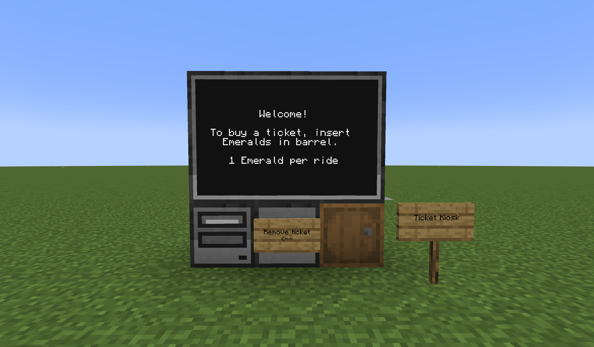
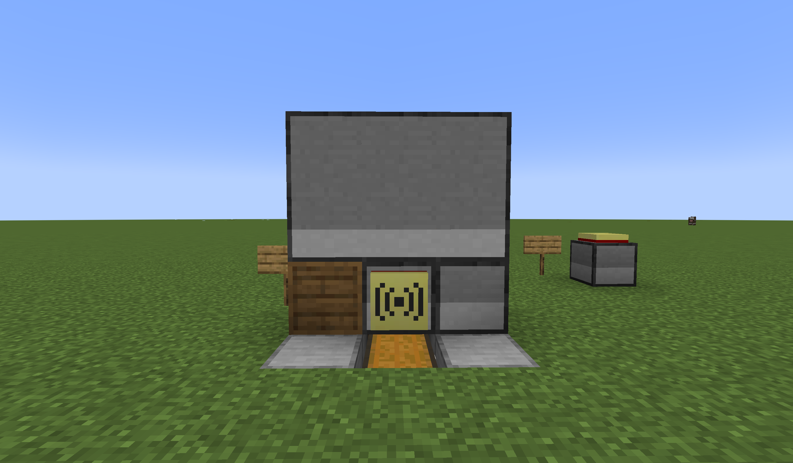
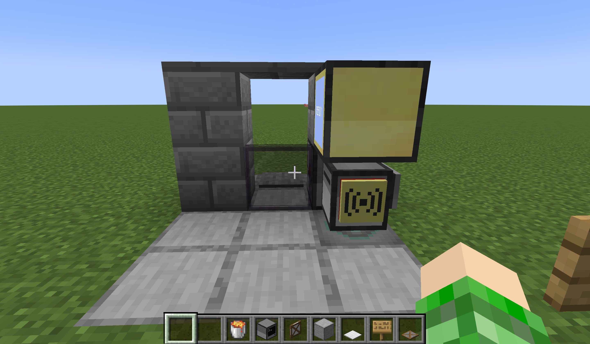
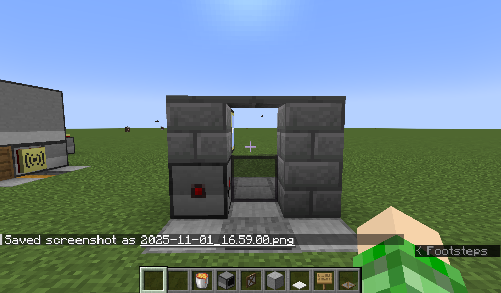

# Subway System
This is a subway system meant to be used with minecarts or trains from the Create mod. It is composed of 3 parts: the server, the ticket kiosk(s), and the turnstile(s). To use it, deposit emeralds in the barrel at a kiosk to buy a ticket and drop the ticket in front of a turnstile to open it.
### Required Mods
- CC: Tweaked
- Advanced Peripherals
## Server
The server should consist of a computer with an Ender Modem on top. To install the program on the computer, run the following command:
```
wget https://github.com/DrgnFireYellow/computercraft-stuff/raw/refs/heads/main/subway_system/server.lua startup
```
After the program has been installed, change the variable `SYSTEM_NAME` in `startup.lua` to the name of your subway system and reboot the computer.
## Ticket Kiosk
Each ticket kiosk should be a computer with a barrel on the left, a printer on the right, storage like a chest or barrel on the bottom, an ender modem on the front, and a 3x2 monitor on the top.


After the kiosk is built, install the program with this command:
```
wget https://github.com/DrgnFireYellow/computercraft-stuff/raw/refs/heads/main/subway_system/ticket_kiosk.lua startup
```
Then, set the `SYSTEM_NAME` variable in the `startup.lua` file to match your server's `SYSTEM_NAME` variable.
## Turnstile
Each turnstile should consist of a turtle with an advanced monitor on top, an Ender Modem in a peripheral slot, a redstone relay facing towards a gate or door on the opposite side from the Ender Modem, and a Block Reader below it that is facing up.


To install the program onto the turtle, run the following command:
```
wget https://github.com/DrgnFireYellow/computercraft-stuff/raw/refs/heads/main/subway_system/turnstile.lua startup
```
After the program is installed, set the `SYSTEM_NAME` variable in the `startup.lua` file to match your server.